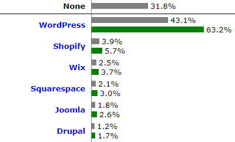

# Introduction to WordPress

&nbsp;&nbsp;

WordPress is an open source **Content Management System** *(CMS)*. A **CMS** is a software application that allows users to create, manage, and modify digital content on a website without requiring advanced technical knowledge. It separates the design and structure of a website from its content, making it easier to update and maintain. 

Popular CMS platforms include *WordPress*, *Joomla*, *Drupal* and *Magento*, each with its own strengths and specialties. In this course we are going to focus on *WordPress*. 

## 1. What is WordPress?

WordPress is a web publishing system based on posts sorted by date; entries correspond to one or more categories or taxonomies. It was released in 2003 and it is focused on the creation of any type of web page. Originally it reached great popularity in the creation of blogs, to later become one of the main tools for the creation of commercial web pages.  

Its main characteristics are the following:
* **Intuitive content management:** WordPress makes it easy to create, edit, and publish content. Allows you to organize content into categories and tags, making it easy to navigate and search for information. It also enables multiple users to collaborate on content creation. 
* **Wide variety of customizable themes and layouts:** It offers a wide range of predefined and customizable themes, which allow you to easily change the visual appearance of a website. Many of these themes are designed to follow the standards set by the W3C. This means you can find themes that not only look good but also meet the guidelines of the [W3C](https://www.w3.org/) *(World Wide Web Consortium)*. The W3C is an international consortium that develops standards and guidelines for the web. Its main objective is to guarantee the interoperability and accessibility of the web for all users. The W3C sets standards in areas like HTML, CSS, XML, web accessibility, and many other related technologies.
* **Availability of plugins to add additional functionality:** WordPress has a wide variety of plugins that extend its functionality. These plugins allow you to add features such as contact forms, image galleries, integration with social networks, SEO optimization, security, etc.
* **SEO and search engine optimization:** WordPress includes features that facilitate search engine optimization (SEO). It allows you to customize key elements, such as metadata, tags and permalinks, to improve visibility and positioning in search results.
* **Mobile adaptability:** WordPress themes and layouts are designed to adapt to different screen sizes, ensuring an optimal browsing experience on both desktop and mobile devices. 
* **Active user community and support:** WordPress has an active community of users and developers who share knowledge, resources, and provide technical support. This makes it easy to find answers to questions, troubleshoot, and access additional resources.

These are just some of the main features of WordPress, but the platform offers more functionality and customization possibilities, making it a popular choice for building websites of different types and sizes. 

The latest version of **WordPress is 6.2.2**. If you want to know the latest version available I recommend you visit the [official page](https://wordpress.org/download/releases/)

## 2. WordPress.com y WordPress.org.

WordPress allows us to host a site in two ways, [WordPress.com](https://wordpress.com/es/) and [WordPress.org](https://wordpress.org/). Both options are free, and each has its advantages and disadvantages:
* **WordPress.com** is an online platform that provides free web hosting and makes it easy to build websites without the need for advanced technical knowledge. However, it has limitations in terms of customization and functionality.
* **WordPress.org** is the official WordPress site, where you can download the WordPress software for free and use it on your own web server. It offers more flexibility and control over the website, allowing for more advanced functionality and customization.

In this course we will focus on the second option. We will see how to download and install it to create our own CMS server and manage it.

## 3. Websites created with WordPress

If you want to find out how many websites are built with WordPress, a reliable and current source of information is [W3Techs](https://w3techs.com/). They analyze web technology and provide statistics on the use of different content management systems (CMS) worldwide. The following report from *June 16, 2023* shows the percentage of websites using WordPress compared to other CMS.

    

This diagram shows the percentages of websites using various CMS. *31.8%* of the websites use none of the content management systems that W3Techs monitors.
WordPress is used by *43.1%* of all the websites, that is a content management system market share of *63.2%*.

Here are some examples of popular websites using WordPress:
* [The White House](https://www.whitehouse.gov/es/), the official website of the White House allows use WordPress to easily update information on the site, such as speeches, news, events, and policies. It is also used to manage contact forms and email subscriptions.
* [Mercedes-Benz](https://www.mercedes-benz.es/passengercars.html), this global car company uses WordPress to display their car models, explore different options, customize vehicles and learn about features.
* [Walt Disney Company](https://thewaltdisneycompany.com/), the Walt Disney Company's official website uses WordPress to give information about their movies, theme parks and television.
* [The Jane Goodall Institute](https://www.janegoodall.org), uses WordPress to share news, articles, conservation projects and educational resources. It also accepts donations and encourages community participation.
* [The Official Star Wars Blog](https://www.starwars.com/news), the official blog of Star Wars uses WordPress as a platform to share news, announcements and content related to the Star Wars universe.

