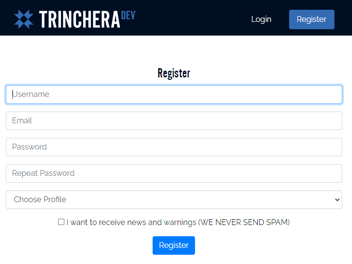
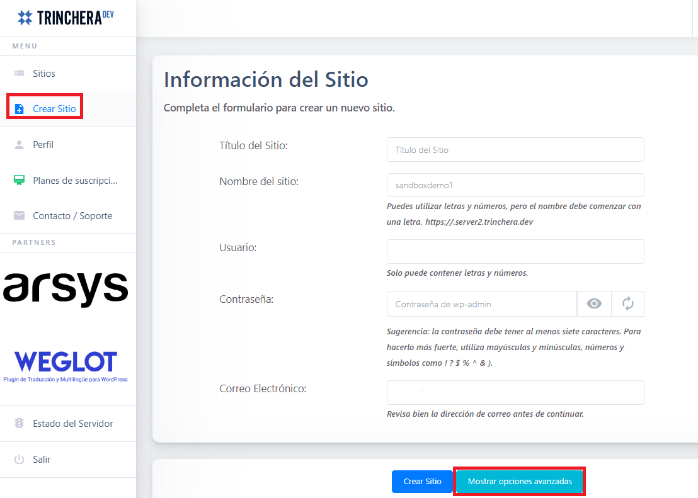
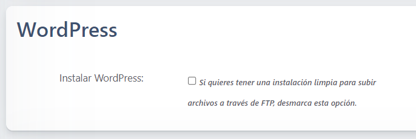
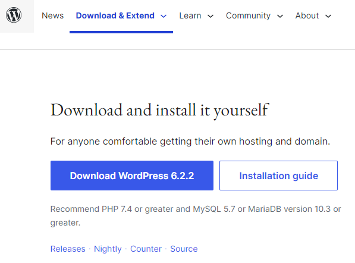

# Wordpress installation

&nbsp;&nbsp;

Installing WordPress is usually an easy process, especially if you use tools and services that make it simple. WordPress has a large community of users and is plenty of online guides. If you have any problems during the installation, you can find solutions and answers in support forums or specialized blogs.

## 1. WordPress Installation Types

There are several ways to install WordPress, depending on your needs and preferences.

* **Manual installation:** This method involves downloading the WordPress files from the official website (wordpress.org/download), setting up a database, and uploading the files via FTP (*File Transfer Protocol*) to the web hosting server. Then the initial configuration is done and the installation is completed using the WordPress wizard.
* **Local Installation:** You can install WordPress on your local computer for development and testing purposes using software like XAMPP, WAMP, or MAMP, which creates a local server environment on your machine. After setting up the environment, you can download the WordPress files and install just like you would on a remote server.
* **Installation with a one-click installer:** Many web hosts offer one-click installers, such as Softaculous or Fantastico, that simplify the installation process. You just need to access the control panel of your web hosting account, search for WordPress in the list of available applications and follow the steps to install it automatically.
* **Cloud installation:** Some cloud service providers, such as *Amazon Web Services (AWS)* or *Google Cloud Platform (GCP)*, offer services that allow you to create and configure a virtual server to install WordPress. These options typically require a bit more technical knowledge and configuration, but provide flexibility and scalability.

Indicar qué instalación se va a usar. 

## 1. Installation process

Before installing WordPress, you need to check that your web hosting provider fulfills the necessary software and conditions. Also, you must have access to the server and some tools.

**Requirements on the server side**
* PHP 7.4 or greater
* MySQL 5.7 or MariaDB 10.3 or greater
* HTTPS support

**Requirements on local**
* Login Account (user id and password) to the server via FTP or shell
* Text Editor
* FTP program to upload files to the server. You could choose FileZilla for this task.
* Your web browser of choice

### Step 0: Domain purchase, hosting and requirements

Before installing Wordpress, you must buy a domain on a server or service hosting (that allows PHP and MySQL). You can also install it on a local server (for example, XAMPP or similar) to test before publishing the final version on the server where you have contracted the domain. 

#### Registration in Trinchera DEV

[Trinchera DEV](https://trincheradev.com/) offers free hosting for WordPress pages. Free accounts have the following limitations:
* Each user can only create one WordPress site
* Each site has a maximum space of 512MB
* Each site has a MySQL database
* PHP memory limit is 128Mb for each site

Also, you should keep in mind that all pages that are not active for 14 days will be deactivated. After 30 days, the deactivated pages will be removed from their servers.

Create your free account by access the [registration page](https://trincheradev.com/home/register)

    

To finish the process, you must confirm the registration from a link that will be sent to the email that you have indicated in the registration form. 

#### Create a site on Trinchera DEV

Once you have completed the registration successfully, log in and click on the **`Create a site`** option and follow these steps:

1. Enter a **title** and **name** for your website.
   

    

2. Click on the **`Show advanced options`** button. There you can choose between a *clean install* and a *guided installation*. In the clean install you can upload your files via FTP and in the guided installation you can follow a step-by-step process and choose the plugins, theme, and other options you want to install. In this case, we are going to perform a **clean installation**.

    

### Step 1: Download from Wordpress and upload to the server

Download and unzip the WordPress package from [`wordpress.org/download/`](https://wordpress.org/download/).

    

### Step 2: Creating the database

### Step 3: Start the wizard

## 2. Basic configuration

